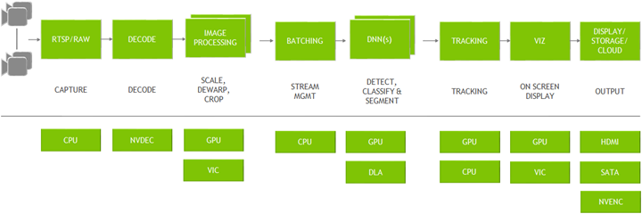

# DeepStream

NVIDIA 的 DeepStream SDK 提供了一套完整的流分析工具包，用于基于 AI 的多传感器处理、视频和图像理解。Deepstream SDK 大量使用开源多媒体处理库 Gstreamer。DeepStream SDK 可用于构建端到端 AI 驱动的应用程序来分析视频和传感器数据。

它可将来自 USB/CSI 摄像头的媒体流数据、来自文件的视频或通过网络传输的媒体流作为输入，并使用人工智能和计算机视觉从中进行分析和推理，以便更好地了解视频中的内容。


DeepStream SDK 可以成为许多视频分析解决方案的基础框架，例如了解智慧城市中的交通和行人、医院中的健康和安全监控、医学影像分析, 零售业中的自助结账和分析、检测制造工厂中的组件缺陷等.


DeepStream是NVIDIA基于GStreamer的插件系统开发的, 继承了GStreamer的特性。DeepSream提供超过15种以上的GStreamer插件模块, 以此建造一个高效的视频分析管道（Pipeline）。

NVIDIA将 TensorRT, cuDNN, CUDA, Video SDK 等以插件的形式集成进 GStreamer 当中, 以管道的形式进行智能视频分析应用的开发, 将各个功能封装成组件, 通过将对应功能的组件插入管道中, 启动管道使数据按照要求在管道内流动, 数据经过解析、编解码、预处理、算法处理后进行图像渲染或者发送到云端。

例如

* nvv4l2decoder 用于调用 GPU 硬件加速解码 h264 文件 （解码帧的格式是 NV12（YUV420））
* nvstreammux 用于把输入按照参数处理成一系列的视频帧 
* nvinfer 通过推理的配置文件对输入图像进行推理 
* nvvideoconvert 视频颜色格式转换 
* nvdsosd 处理 RGBA buffer 绘制 ROI 等 识别对象的 Bounding Box, 边框,  以及识别对象的文字标签（字体、颜色、标示框） 
* nvegltransform 转换成 EGLImage instance 给nveglglessink使用
* nveglglessink 渲染

## DeepStream Graph Architecture

DeepStream是使用开源 GStreamer 框架构建的优化的图架构。 下图显示了从输入视频到输出见解的典型视频分析应用程序。 所有单独的块都是使用的各种插件。 底部是整个应用程序中使用的不同硬件引擎。 插件之间零内存复制的最佳内存管理以及各种加速器的使用确保了最高性能。



DeepStream 以 GStreamer 插件的形式提供构建块，可用于构建高效的视频分析管道。 有超过 20 个针对各种任务进行硬件加速的插件。

* 视频流数据可以通过网络传输, 或本地文件系统, 或直接从摄像头捕获。流使用 CPU 捕获。一旦帧进入内存，它们就会被发送到 NVDEC 加速器进行解码。解码插件称为“Gst-nvvideo4linux2”。

* 解码后，有一个可选的图像预处理步骤，其中可以在推理之前对输入图像进行预处理。预处理可以是图像去扭曲或颜色空间转换。`Gst-nvdewarper` 插件可以对鱼眼或 360 度相机的图像进行去扭曲。`Gst-nvvideoconvert` 插件可以对帧执行颜色格式转换。这些插件使用 GPU 或 VIC（视觉图像合成器）。

* 下一步是批量处理帧以获得最佳推理性能。批处理是使用“Gst-nvstreammux”插件完成的。

* 一旦帧被批处理，它就会被发送到下一插件进行推理。可以使用 TensorRT（NVIDIA 的推理加速器运行时）进行推理，也可以使用 Triton 推理服务器在 TensorFlow 或 PyTorch 等本机框架中完成推理。本机 TensorRT 推理是使用“Gst-nvinfer”插件执行的，使用 Triton 的推理是使用“Gst-nvinferserver”插件执行的。推理可以使用 Jetson AGX Orin 和 Orin NX 的 GPU 或 DLA（深度学习加速器）。

* 推理之后，下一步可能涉及跟踪对象。 SDK 中有多个内置参考跟踪器，从高性能到高精度不等。 使用 `Gst-nvtracker` 插件执行对象跟踪。

* 为了创建可视化工件（例如边界框、分割蒙版、标签），有一个名为“Gst-nvdsosd”的可视化插件。

* 最后，为了输出结果，DeepStream 提供了各种选项：使用屏幕上的边界框渲染输出、将输出保存到本地磁盘、通过 RTSP 流式传输或仅将元数据(metadata)发送到云端。为了将元数据发送到云端，DeepStream 使用“Gst-nvmsgconv”和“Gst-nvmsgbroker”插件。Gst-nvmsgconv 将元数据(metadata)转换为模式负载(schema payload)，Gst-nvmsgbroker 建立与云端的连接并发送遥测数据。有几种内置代理协议，例如 Kafka、MQTT、AMQP 和 Azure IoT。可以创建自定义代理适配器。

## DeepStream reference app

首先，开发人员可以使用提供的参考应用程序。这些应用程序的源代码也包含在内。

端到端应用程序称为 deepstream-app。此应用程序完全可配置 - 它允许用户配置任何类型和数量的源。

用户还可以选择要运行推理的网络类型。

它预装了一个推理插件，用于进行对象检测，并通过推理插件进行级联以进行图像分类。有一个选项可以配置跟踪器。

对于输出，用户可以选择在屏幕上渲染、保存输出文件或通过 RTSP 流式传输视频。


## Example

* 安装依赖库

```
$ sudo apt install \
libssl3 \
libssl-dev \
libgstreamer1.0-0 \
gstreamer1.0-tools \
gstreamer1.0-plugins-good \
gstreamer1.0-plugins-bad \
gstreamer1.0-plugins-ugly \
gstreamer1.0-libav \
libgstreamer-plugins-base1.0-dev \
libgstrtspserver-1.0-0 \
libjansson4 \
libyaml-cpp-dev
```

```
DISPLAY=:0 gst-launch-1.0 -v filesrc location=talk.mp4 ! qtdemux ! h264parse \
! nvv4l2decoder ! m.sink_0 nvstreammux name=m batch-size=1 width=1280 height=720 \
! nvvideoconvert ! dsexample full-frame=1 ! nvdsosd ! nv3dsink

DISPLAY=:0 gst-launch-1.0 -v filesrc location=talk.mp4 ! qtdemux ! h264parse \
! nvv4l2decoder ! m.sink_0 nvstreammux name=m batch-size=1 width=1280 height=720 \
! nvvideoconvert ! dsexample full-frame=1 ! nvdsosd ! autovideosink
```


## Reference
* https://resources.nvidia.com/en-us-deepstream-get-started-with-c-cpp