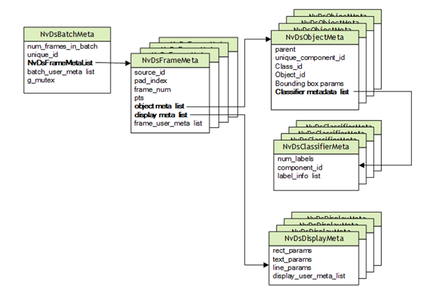

# MetaData in the DeepStream SDK

Gst Buffer is the basic unit of data transfer in GStreamer. Each Gst Buffer has associated metadata. The DeepStream SDK attaches the DeepStream metadata object, NvDsBatchMeta.

## NvDsBatchMeta

Basic Metadata Structure

DeepStream uses an extensible standard structure for metadata.

The basic metadata structure NvDsBatchMeta starts with batch level metadata, created inside the Gst-nvstreammux plugin. Subsidiary metadata structures hold frame, object, classifier, and label data.

DeepStream also provides a mechanism for adding user-specific metadata at the batch, frame, or object level.

DeepStream attaches metadata to a Gst Buffer by attaching an NvDsBatchMeta structure and setting GstNvDsMetaType.meta_type to NVDS_BATCH_GST_META in the Gst-nvstreammux plugin. When your application processes the Gst Buffer, it can iterate over the attached metadata to find NVDS_BATCH_GST_META.

The function gst_buffer_get_nvds_batch_meta() extracts NvDsBatchMeta from the Gst Buffer. (See the declaration in sources/include/gstnvdsmeta.h.) See the deepstream-test1 sample application for an example of this function’s usage.

For more details, see the DeepStream SDK API reference documentation in DeepStream API Guides.

## User/Custom Metadata Addition inside NvDsBatchMeta

To attach user-specific metadata at the batch, frame, or object level within NvDsBatchMeta, you must acquire an instance of NvDsUserMeta from the user meta pool by calling nvds_acquire_user_meta_from_pool().
 (See sources/includes/nvdsmeta.h for details.)

 Then you must initialize NvDsUserMeta. The members you must set are user_meta_data, meta_type, copy_func, and release_func.

 For more details, see the sample application source code in sources/apps/sample_apps/deepstream-user-metadata-test/deepstream_user_metadata_app.c.

## Reference
* https://docs.nvidia.com/metropolis/deepstream/dev-guide/text/DS_plugin_metadata.html